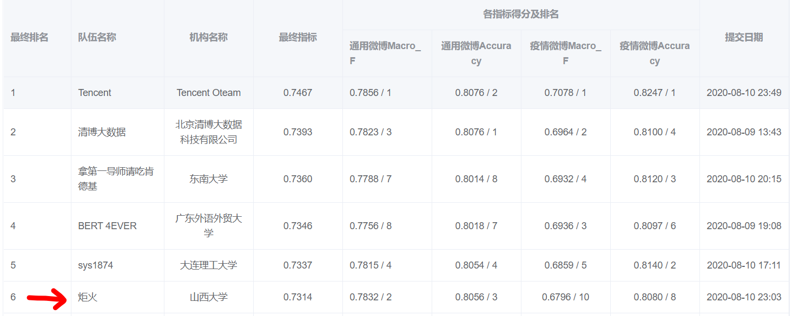
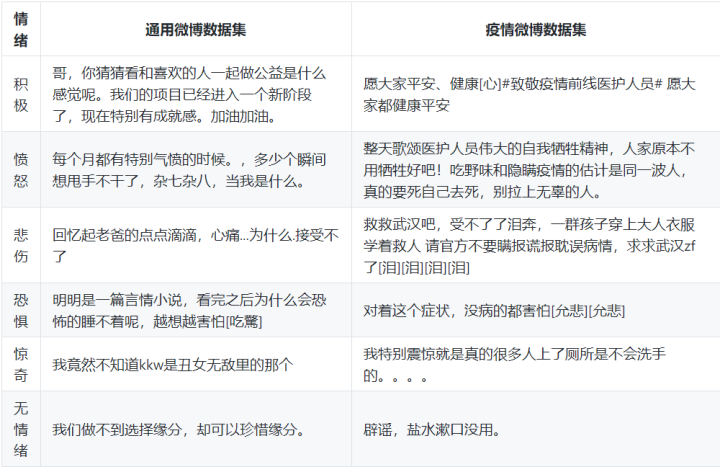
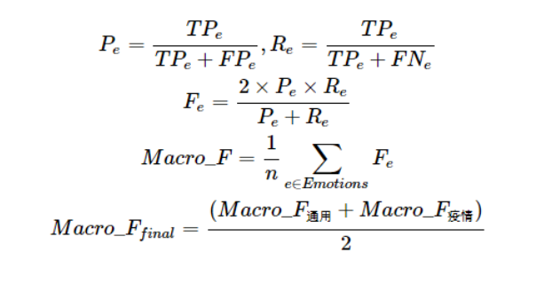

# smp-ewect-code
这是2020年smp-ewect情感分析评测的代码，在最终排行第6，获得三等奖。

比赛简介

此次比赛报名队伍共189支，其中刷榜队伍有77支，提交最终结果的队伍仅42支
SMP2020微博情绪分类技术评测（The Evaluation of Weibo Emotion Classification Technology，SMP2020-EWECT）共包含两类数据集，分别是通用（usual）与疫情（virus），这两类数据集都包含六类情绪，积极(happy)、愤怒(angry)、悲伤(sad)、恐惧(fear)、惊奇(surprise)和无情绪(neural)。
两个数据集的各类情绪微博举例如下表所示：

这题虽然是情感分析，但是可以简化为一个文本分类问题,本次比赛主要是以F1值作为最终的评估指标。

本次比赛在普通的bert for sequence classification代码进行改进，主要包括一下几点：
- 网络结构的改进，这部分的定义主要定义在net中，主要包括pooling方法改进，loss function的改进。
- 数据清洗，对原始数据中的乱码字符进行清洗，这部分主要定义在clean_data.py中。
- k折交叉训练，这部分主要在roberta_k_fold.py中。
- 多模型投票，主要采用stacking和voting两种方法。
- 迁移学习，利用usual数据微调roberta的encoder部分，以此来初始化virus的encoder部分，这部分主要定义在net中的bert_transfer_learning中。
- 对抗训练，根据模型的前向传播结果在embedding层添加反向梯度，以此来提高模型的稳定性，这部分定义在，net.utils.fgm中
- 另外，本代码还支持，xlnet，electra等模型的加载，以及bert mask任务的预训练。

如何运行
- 运行 run_k_fold.sh 显存不足需要调整batch size，本队训练过程中均通过软batch将size设置为64，随机种子也已经固定。
- 运行 run_k_fold_test.sh 预测模型的oof文件，train过程也会生成对应结果。
- 运行 convert_format.sh 根据oof文件生成单模型的提交结果。
- 运行 voting.py 会根据目录下各个模型的oof文件进行投票集成，并生成最终的结果。
- 运行 stacking.py 会根据目录下各个模型的oof文件进行staking集成，并生成最终结果。

预训练模型的下载
- roberta，electra：在huggingface的[模型库](https://huggingface.co/models) 中搜索即可。
- roberta wwm ext， xlnet: 在[哈工大讯飞联合实验室](https://github.com/ymcui) 的GitHub中下载。
- uer mixed large: 在[UER-py的官网](https://github.com/dbiir/UER-py) 下载即可。

写在最后
- 在这里感谢张同学对于本次比赛的辛苦付出，可以fork和star他的[github](https://github.com/Tianweidadada/SMP2020---Weibo-sentiment-classification) 。
- 同时感谢丁同学的辛苦付出，丁同学对于本次各支队伍的方案进行了总结([csdn](https://blog.csdn.net/qq_40200387/article/details/108457693), [zhihu](https://zhuanlan.zhihu.com/p/222138885))
- 查看其他队伍的技术报告可以访问，[smp的官网](http://39.97.118.137/)

联系我们
- 2725958627@qq.com, 杨同学
- bravezhangw@163.com, 张同学
- blueghost.contact@foxmail.com, 丁同学